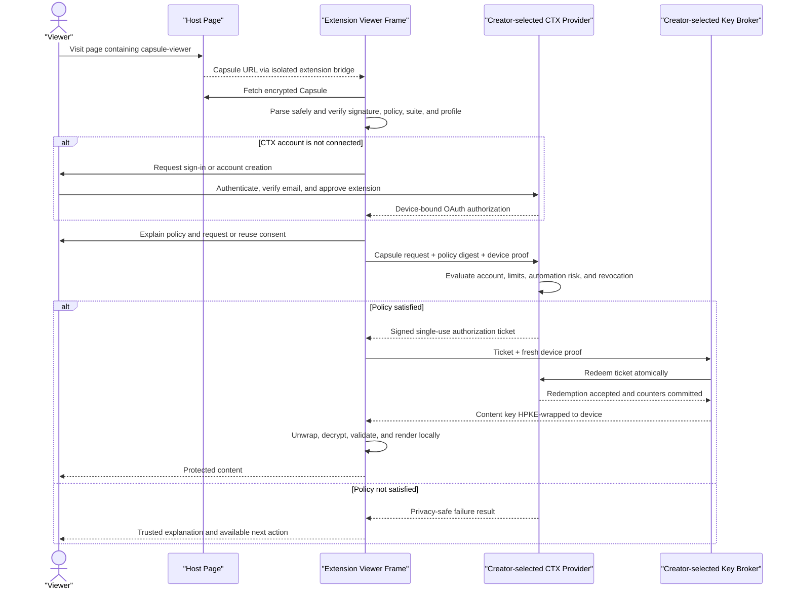

# End-to-End Capsule Access and Data Flow

Status: Draft
Last updated: 2026-06-24

## Purpose

Provide the canonical V1 interaction from local creator content through Host publication, inline discovery, CTX authorization, key release, decryption, rendering, failure, and session disposal.

## High-level model

1. A creator uses trusted local tooling to transform source content into a signed and encrypted `.capsule` file.
2. The creator publishes that file at any compatible HTTPS Host.
3. A Host page declares the Capsule with a `<capsule-viewer>` element and accessible fallback content.
4. The browser extension discovers the element after the viewer grants site access and replaces it with an extension-controlled inline frame.
5. The extension verifies the Capsule, establishes or reuses a CTX account connection, obtains consent, and asks the creator-selected CTX Provider to evaluate the embedded policy.
6. On success, the CTX Provider issues a short-lived ticket and the creator-selected key broker releases the content key encrypted to the registered Viewer device.
7. The extension decrypts and renders inside its own origin. The Host never receives account credentials, trust evidence, tickets, keys, or plaintext.

For official Share Capsules tools, "creator-selected" means selected from the official recognized network. V1 recognizes only the Share Capsules CTX Provider and Key Broker. Future services may be selectable after registry recognition; arbitrary provider or broker URLs are not trusted by default.

## Terminology boundaries

- The **Capsule ID**, **Capsule revision**, and **payload ID** identify the exact signed content and policy being requested. A generic `CONTENT_ID` is too ambiguous for protocol messages.
- The Capsule contains an embedded creator-signed **policy**. It does not contain a viewer's trust profile.
- The Capsule identifies a **CTX Provider issuer** and key broker. The CTX Provider may obtain assertions from separate **Trust Providers**.
- The extension uses a device-bound **OAuth access token** to call the CTX Provider. It does not expose or transmit a reusable browser `SESSION_ID`.
- CTX returns an **authorization ticket**, not a content key.
- The **key broker** redeems the ticket and returns the content key HPKE-wrapped to the Viewer agreement key.

## Creator and publication flow

1. The creator selects source content supported by an installed creator content profile.
2. Creator tooling validates the source and derives safe signed metadata.
3. The extension generates a unique AES-256-GCM content key and nonce.
4. It encrypts the payload locally as `payloads/<payload-id>.enc`.
5. The control plane validates the canonical public policy, verifies its digest, creates an immutable creator-owned pending revision, and issues a short-lived broker-registration grant.
6. The broker stores the content key as pending and returns an opaque release handle; pending keys cannot satisfy release requests.
7. The extension builds and signs the canonical manifest containing the exact CTX Provider and broker bindings.
8. It packages `manifest.json`, `manifest.sig`, and the ID-addressed encrypted payload entry, then reopens the emitted bytes with the strict reader.
9. After strict verification, the extension idempotently finalizes the pending revision. The control plane activates the authoritative registry record only as the broker confirms activation.
10. The creator exports and uploads the active opaque Capsule to a creator-selected HTTPS Host and adds declarative Host markup.

Share Capsules may retain creator, policy, broker, and Capsule metadata required for its CTX and key-release roles. It does not receive creator plaintext, an unencrypted creator signing key, or an unwrapped content key through the ordinary creation flow.

For content-key registration, the extension first sends the authenticated Laravel control plane only a SHA-256 key digest plus the exact Capsule, revision, payload, canonical public policy, and stable registration bindings. Laravel independently parses the policy, verifies its digest, records its immutable safe summary, and issues a 60-second digest-bound grant. The extension then sends that grant and a temporary raw-key encoding directly to the configured broker origin. In hardened deployments that origin resolves to a broker-only runtime; in prototype deployments it may resolve to the same Laravel installation as the control plane while retaining a distinct host identity. The Laravel page and control plane never proxy or receive the raw content key.

Registration success is provisional rather than publication success. The broker record remains non-releasable until the locally assembled archive passes the shared strict reader and an exact idempotent finalization request succeeds. If signing, packaging, verification, download preparation, or finalization cannot complete, the extension requests cancellation; missing clients and ambiguous failures are covered by the pending deadline and scheduled idempotent cleanup. Stable registration identifiers make finalize and cancel safe to retry.

## Declarative Host integration

V1 uses an autonomous custom element name containing a hyphen:

```html
<capsule-viewer src="/capsules/my-image.capsule">
  
  <a href="https://sharecapsules.com/open?capsule=...">
    Open protected content
  </a>
</capsule-viewer>
```

The `src` value may be relative and is resolved against the Host document URL. V1 accepts only HTTPS Capsule URLs. The nested content is ordinary accessible fallback content when the extension is absent, site permission is declined, the required Viewer is unavailable, or inline initialization fails.

Everything between the opening and closing `<capsule-viewer>` tags is public Host content. It is not embedded in the Capsule, covered by the creator signature, or trusted as Capsule metadata. The trusted frame displays verified signed creator and content metadata when identity or policy context matters.

The fallback link opens a Share Capsules onboarding page that explains the extension requirement, links to the official Chrome Web Store listing, and preserves a safe return or Capsule location for post-install resumption. It never carries credentials, tokens, tickets, evidence, or keys in the URL. See [Viewer fallback and assurance](../06_viewer/fallback-and-assurance.md).

The element is declarative. It conveys a Capsule location but cannot authenticate a viewer, define authoritative policy outside the signed Capsule, receive trust results, or access protected content.

## Viewer components and trust boundary

After the viewer grants optional access to the top-level Host origin, an isolated content script discovers `<capsule-viewer>` elements. It passes only validated element and URL information to the extension and inserts an extension-origin iframe.

The content script and Host DOM never receive OAuth tokens, device private keys, authorization tickets, content keys, plaintext, or detailed policy results. Capsule fetching, package validation, CTX interaction, key handling, decryption, and rendering occur in trusted extension components.

Inline presentation is less visually isolated than a full-page Viewer because a Host can resize, cover, move, or remove the frame. The Host still cannot read the cross-origin frame DOM. The frame offers an action to open the same Capsule in a full-page extension-controlled Viewer when the viewer wants a clearer high-assurance presentation boundary.

## Sequence overview



## Detailed viewing flow

### 1. Discover and initialize

The content script observes eligible `<capsule-viewer>` elements in the top-level page. It resolves each `src`, rejects non-HTTPS or malformed URLs, preserves the fallback content, and inserts a locked extension frame.

V1 does not scan unrelated DOM content or nested third-party frames for implicit Capsule links. The explicit element is the discovery contract.

### 2. Decide whether to open automatically

An authenticated account alone does not imply permission for a Host to consume Capsule views. On first use, the viewer separately approves site access and whether that site may automatically open eligible Capsules.

With standing site-scoped consent, compatible Capsules may open automatically so protected content behaves like ordinary web media when the Viewer can satisfy the current policy. Without it, the frame remains locked until the viewer connects and approves the required disclosure.

Automatic opening must:

- Be revocable per site
- Re-prompt when required disclosure or policy meaning materially changes
- Preserve normal Host show/hide layouts such as tabs, accordions, carousels, and modals
- Apply queueing, rate handling, and safety limits to unusual bulk automatic releases
- Explain that committed automatic releases count against creator limits

The safety checks are local Viewer controls, not behavioral reputation telemetry. Visibility can inform future user experience decisions, but visibility alone is not a hard key-release blocker.

### 3. Fetch the encrypted Capsule

The extension requests optional HTTPS Host permission when needed and downloads the complete `.capsule` file in V1. It enforces the [Compatible Host contract](compatible-host.md), including redirect validation and bounded reading when `Content-Length` is unavailable. The Host observes an ordinary file request and network metadata but receives no CTX or account information.

V1 downloads one complete rendition. Future range-based adaptive retrieval is defined separately.

### 4. Parse and verify before authorization

The extension applies ZIP allowlists and resource limits before allocating or processing entries. It rejects duplicate names, traversal paths, symbolic links, undeclared files, unsupported ZIP features, and length or hash mismatches.

It then verifies:

- RFC 8785 manifest representation
- Ed25519 creator signature
- Capsule ID and revision
- Package-entry hashes and sizes
- Capsule and policy versions
- Embedded policy and policy digest
- Cryptographic-suite identifier
- Required content-profile identifier and version
- CTX issuer and key-broker identifiers
- Release handle and encryption metadata
- Device compatibility and resource envelope

Official Viewers also verify that the CTX issuer and key broker are recognized for the current environment and protocol profile before sending credentials, proofs, tickets, or key-release requests.

No endpoint named by an unverified or incompatible manifest receives credentials or device proofs.

### 5. Establish or reuse the CTX account connection

If the extension is not connected to the required CTX Provider, the frame shows a locked state and requires a user gesture before launching account interaction.

For Share Capsules, the viewer may need to create an account, verify email, sign in, approve OAuth Authorization Code with PKCE, and register the installation's Ed25519 proof key and X25519 agreement key.

The normal website login session may make authentication easier, but the extension receives its own short-lived, DPoP-bound OAuth credentials. It never receives the account password or forwards a browser session cookie or reusable session identifier to a Host or broker.

### 6. Explain policy and obtain consent

The trusted Viewer explains the creator requirements, accepted assertion issuer, Capsule limits, automation-risk gate, information used by CTX, recipient, purpose, and counting consequences.

The viewer may approve, decline, or complete an available alternative. Valid standing site-scoped consent may be reused only when its disclosure and policy scope covers the current request.

### 7. Request CTX authorization

The extension sends the CTX Provider:

- Capsule ID and revision
- Payload ID
- Opaque broker release handle
- Canonical embedded-policy digest
- Requested action such as `render`
- Approved disclosures
- Device-bound OAuth access token
- Fresh Ed25519 device proof

The provider obtains the signed policy from trusted registered metadata or receives sufficient signed manifest material to verify the request. It does not trust an unsigned client restatement of policy.

The CTX Provider evaluates verified email, account and device status, consent, creator-configured opening and closing instants, Capsule-global and per-account limits, optional current automation risk, revocation, and operational abuse controls.

### 8. Return authorization or failure

If policy succeeds, CTX returns a signed Ed25519 JWT ticket with an exact 60-second lifetime, exact broker audience, unique single-use identifier, and bindings to the Capsule, revision, policy digest, payload, opaque broker release handle, action, suite, and both Viewer device keys.

The ticket contains no global account identifier, raw trust profile, password, content key, or recovery material.

If policy fails, CTX returns a structured privacy-safe reason. Raw scores, global viewing history, exact abuse thresholds, and unrelated account state are not disclosed to the Host or creator.

### 9. Redeem the ticket and release the content key

The extension sends the ticket and a fresh `ctx-key-release-proof+jwt` proof to the identified broker. The proof binds its HTTP method, broker endpoint, creation time, unique identifier, and the exact ticket hash. The broker validates the fixed ticket and proof types and algorithms, issuer key, exact audience, time window, identifiers, action, suite, ticket hash, and device-key bindings.

The broker prepares the content key HPKE-wrapped to the registered X25519 agreement key, then redeems the ticket online. Redemption atomically:

- Confirms the ticket is pending, current, and unused
- Rechecks account, device, revocation, limits, and current enforced risk where applicable
- Marks the ticket consumed
- Increments the Capsule-global and account-and-Capsule lifetime counters

Only after successful redemption does the broker return the wrapped key. Tickets that never redeem do not count. A transport failure after redemption may count because the release was committed before response delivery.

### 10. Decrypt, validate, and render

The extension uses its X25519 private key to recover the content key, authenticates and decrypts the selected `payloads/<payload-id>.enc` entry in memory, and runs the plaintext through the required trusted content profile.

The V1 static-image profile verifies JPEG, PNG, or WebP structure, rejects animated or unsupported forms, enforces the measured resource envelope, creates an extension-origin in-memory object URL, and renders within the extension iframe.

The Host cannot read the iframe DOM, object URL, plaintext, or keys. It may observe only the public element, encrypted file request, iframe placement, and ordinary page/network behavior.

### 11. Dispose the viewing session

When the inline or full-page Viewer closes, navigates, or is removed, the extension:

- Revokes object URLs
- Releases rendered objects and plaintext buffers
- Discards the unwrapped content key
- Persists no plaintext in normal browser storage or cache

JavaScript cannot guarantee physical zeroization of every browser-managed memory copy, so the security promise is best-effort lifecycle containment rather than perfect memory erasure.

Reloading or reopening after disposal requires a fresh CTX authorization and committed key release.

## Failure presentation

The trusted frame presents actionable states such as:

- Extension or site permission required
- CTX sign-in, account creation, or email verification required
- Device registration or consent required
- Capsule-global or per-account limit reached
- Current automation risk is high
- Unsupported Capsule, policy, suite, content profile, or device envelope
- Invalid signature, malformed package, or failed payload authentication
- CTX Provider or key broker temporarily unavailable

The Host receives no detailed failure message. Any future Host-visible state must be generic enough not to become an account, trust, or viewing-history oracle.

## Information boundaries

| Party                   | Intended information                                                                                    |
| ----------------------- | ------------------------------------------------------------------------------------------------------- |
| Host                    | Element source, public fallback, encrypted Capsule request, iframe placement, ordinary network metadata |
| Isolated content script | Top-level site, Capsule element and resolved URL, generic frame lifecycle                               |
| Trusted Viewer          | Capsule, approved disclosure, ticket, content key, plaintext during the active session                  |
| CTX Provider            | Private account mapping, device proof, signed policy, consent, applicable evidence, limits, decision    |
| Key broker              | Capsule and payload identifiers, valid ticket, proof/agreement public-key identifiers, release handle   |
| Creator                 | Policy-level or aggregate access information explicitly supported by the product                        |

## V1 browser permissions implied by this flow

V1 requires `identity`, `storage`, and `scripting`, plus required access to `https://sharecapsules.com` and optional runtime HTTPS Host access. The development build may additionally require localhost HTTP origins for local static-host examples because Chrome does not offer a reliable manual UI for arbitrary optional localhost ports. Site permission is needed both to discover inline elements and to fetch Capsule files; a separately hosted Capsule may require a second origin grant.

V1 does not require Chrome profile identity, general history, cookies, downloads, `webRequest`, native messaging, or public HTTP Host access. Dynamically registered content scripts run in an isolated world only on approved top-level origins.

## Related documents

- [System overview](system-overview.md)
- [Share Capsules reference implementation](share-capsules-reference-implementation.md)
- [Compatible Host contract](compatible-host.md)
- [Key management](key-management.md)
- [Browser Viewer](../06_viewer/browser-viewer.md)
- [Viewer content profiles](../06_viewer/content-profiles.md)
- [Privacy model](../07_security-and-privacy/privacy-model.md)
- [CTX authorization and key release](../05_ctx/authorization-and-key-release.md)
- [CTX policy model](../05_ctx/policy-model.md)
- [V1 automation risk](../05_ctx/automation-risk.md)
- [Viewer fallback and assurance](../06_viewer/fallback-and-assurance.md)
