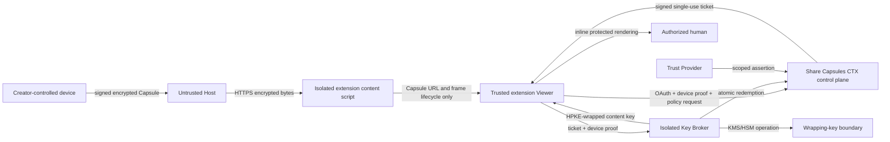

# V1 Threat Model

Status: Draft
Last updated: 2026-06-20

## Purpose

Identify the assets, trust boundaries, attacker capabilities, required mitigations, residual risks, and release-security gates for the Share Capsules V1 architecture.

This is a living threat model. It describes the accepted design, not proof that an implementation satisfies it. Implementation plans and tests must trace security-sensitive work back to these threats.

## V1 security objective

V1 aims to ensure that protected Capsule content is released only after the creator-signed policy is successfully evaluated for a registered Viewer device, while minimizing disclosure and keeping plaintext and creator signing keys out of the Host and normal Share Capsules application path.

The product aims to:

- Prevent anonymous possession of a Capsule from granting decryption
- Detect package, policy, and authorization tampering
- Prevent casual or scalable ticket and key-release replay
- Enforce creator-configured Capsule-global and per-account limits atomically
- Raise the cost of obvious automated harvesting
- Keep Host pages, Laravel, and ordinary Trust Providers away from plaintext and content keys
- Limit the impact of a compromise through key-purpose and service-role separation
- Give viewers informed control over site access, automatic opening, measurement, and disclosure

V1 does not promise perfect post-render copy prevention, unique personhood, an uncompromisable client, or cryptographic zero access by the Share Capsules operator.

## Scope

This model covers:

- Laravel account and CTX control plane
- Creator Studio and shared TypeScript Capsule/CTX library
- Chrome/Chromium extension, content script, inline frame, and full-page Viewer
- `.capsule` ZIP package, manifest, embedded policy, signature, and encrypted payload
- OAuth with PKCE and DPoP-bound extension tokens
- CTX policy evaluation and automation-risk assertion
- Signed single-use authorization tickets and atomic redemption
- Isolated Key Broker and KMS/HSM-backed wrapping keys
- Static Host and `<capsule-viewer>` integration
- Official extension distribution and update path

Future native Viewers, lower-assurance web Viewers, external Trust Providers, independent CTX Providers and brokers, adaptive renditions, and chunked streaming require extensions to this model before release.

## Protected assets

### Creator assets

- Original plaintext content
- Creator Ed25519 signing private key
- Signing-key recovery bundle and recovery code
- Capsule access policy and creator identity continuity
- Unreleased or draft Capsule metadata

### Content assets

- Per-payload AES-256-GCM content key
- Protected plaintext during an authorized Viewer session
- Broker release handle and KMS/HSM wrapping material
- Integrity and authenticity of the Capsule, payload, policy, and revision lineage

### Viewer assets

- Account password, passkeys, and recovery methods
- OAuth access and refresh tokens
- Ed25519 Viewer proof private key
- X25519 Viewer agreement private key
- Approved consent and automatic-opening settings
- Private trust profile, access history, and risk evidence

### Service assets

- CTX authorization-signing keys
- Provider and broker metadata integrity
- Pending and consumed ticket state
- Capsule-global and account-and-Capsule counters
- Automation-risk rules, aggregates, and sanctions
- Audit and incident-response records
- Production extension identity and release pipeline

## Security properties

| Property | Required V1 outcome |
|---|---|
| Confidentiality before authorization | Host possession, network retrieval, or Capsule copying does not reveal protected plaintext |
| Creator authenticity | A Viewer can verify the creator signing key and signed manifest before authorization |
| Policy integrity | CTX evaluates the exact embedded signed policy bound into the authorization ticket |
| Device-bound release | A stolen ticket alone cannot recover a content key without the registered Viewer keys |
| Replay resistance | Tickets are short-lived, exact-audience, device-bound, statefully consumed once, and redeemed online |
| Counter integrity | Capsule-global and per-account counters are checked and incremented atomically at committed release |
| Host isolation | Host scripts do not receive account identifiers, trust evidence, tickets, keys, or plaintext |
| Data minimization | Creators receive predicates or aggregates, not raw global histories or identity evidence |
| Failure safety | Unknown versions, malformed inputs, unsupported capabilities, and cryptographic failure fail closed |
| Honest assurance | The product distinguishes access control from control over an authorized recipient after rendering |

## Trust boundaries

### Trusted within a stated role

- Creator tooling is trusted to generate randomness, protect signing keys, encrypt the intended content, and sign the intended policy.
- The official extension is trusted to validate Capsules, preserve consent boundaries, prove device control, contain keys and plaintext, and render through reviewed content profiles.
- The CTX Provider is trusted to authenticate accounts, verify policy inputs, evaluate current evidence, issue correct tickets, and enforce atomic state.
- A Trust Provider is trusted only for the semantics of its accepted assertion.
- The Key Broker is trusted to validate authorization, use protected key material correctly, and release only to the ticket-bound agreement key.
- Browser cryptographic implementations and selected reviewed libraries are assumed to implement the selected primitives correctly.

### Untrusted or only conditionally trusted

- Host HTML, CSS, JavaScript, and network responses
- Capsule files until their structure, hashes, and creator signature verify
- URLs, metadata, redirects, content types, filenames, and declared dimensions
- Extension messages until sender, document, schema, freshness, and operation verify
- Accounts, devices, and human users as sources of benign intent
- Viewer-controlled operating systems, browsers, developer tools, and modified clients
- Provider discovery documents until issuer and key relationships verify
- Dependencies, builds, and updates until release controls verify

## Attacker profiles

### Anonymous harvester

Copies or crawls public Capsule URLs without an eligible account or registered Viewer. May operate at high volume and adapt to documented behavior.

### Disposable-account harvester

Creates verified-email accounts and devices, distributes activity, throttles requests, or abandons sanctioned accounts. May use rented accounts or human operators.

### Malicious authorized viewer

Satisfies policy legitimately and then attempts screenshots, recording, memory extraction, modified-client use, redistribution, or intentional exhaustion of a Capsule's global views.

### Malicious Host

Controls surrounding markup, scripts, CSS, redirects, Capsule URLs, element visibility, and iframe placement. Attempts credential theft, quota consumption, status probing, clickjacking, parser attacks, or plaintext access.

### Network attacker

Observes, blocks, redirects, replays, or modifies traffic but cannot defeat correctly validated modern TLS.

### Account attacker

Uses credential stuffing, email compromise, OAuth manipulation, stolen tokens, recovery abuse, or social engineering to take over a creator or viewer account.

### Service or supply-chain attacker

Compromises Laravel, the broker, a Trust Provider, KMS/HSM credentials, dependencies, CI, signing infrastructure, extension publisher account, or an operator account.

### Malicious Capsule creator

Builds adversarial ZIPs, manifests, metadata, policies, images, endpoints, or fallback pages to exploit Viewers or learn private viewer state.

## Threat analysis

### TM-01: Capsule forgery or modification

**Threat:** An attacker changes protected content, signed descriptive metadata, provider configuration, broker, policy, algorithms, or revision metadata while preserving the public URL.

**Required controls:** Ed25519 creator signature over canonical manifest bytes; signed entry hashes, sizes, versions, policy digest, provider identities, broker identity, release handle, content profile, and suite; immutable revision URLs; verification before network disclosure or authorization.

The V1 image profile additionally enforces the signed 25 MiB encoded-size, 16,384-pixel per-side, 40-megapixel, and 160 MB nominal decoded-size limits before rendering. The creator checks before packaging; the Viewer checks public metadata before key release where possible and validates actual decrypted structure and dimensions afterward. Mismatch fails closed.

**Residual risk:** A stolen creator signing key can produce apparently authentic Capsules until revocation information is distributed and honored.

### TM-02: Package parser and decompression attacks

**Threat:** A malicious Capsule uses path traversal, duplicate entries, symbolic links, ZIP bombs, oversized fields, integer overflow, unsupported compression, undeclared entries, or inconsistent lengths.

**Required controls:** Fixed V1 entry allowlist; bounded reads and allocations; declared encoded and decoded limits; duplicate and path rejection; no filesystem extraction; parser fuzzing; fail-closed schema validation; process only one supported manifest and profile version.

**Residual risk:** Vulnerabilities may remain in ZIP, JSON, image-decoder, or browser implementations; dependency and browser security updates remain required.

### TM-03: Cryptographic misuse or downgrade

**Threat:** Nonce reuse, weak randomness, algorithm substitution, key-purpose reuse, malformed public keys, unknown suites, signature confusion, or incorrect HPKE context binding exposes content or accepts forgery.

**Required controls:** One pinned V1 suite; unique random content key and 96-bit GCM nonce per payload; separate signing, proof, agreement, authorization, recovery, and wrapping keys; explicit domain separation; exact token types and algorithms; runtime capability detection; public-key validation; published cross-implementation test vectors.

**Residual risk:** Design or implementation errors in a low-level cryptographic composition can be catastrophic and require independent review before production claims.

### TM-04: Malicious Host access to plaintext or credentials

**Threat:** Host JavaScript reads credentials, messages, object URLs, content keys, trust evidence, or decrypted content.

**Required controls:** Isolated content script; extension-origin iframe; strict message schemas and sender/document checks; no plaintext in Host DOM; no privileged result returned to page scripts; full-page fallback; CSP and safe DOM APIs; no Host-page JavaScript Viewer.

**Residual risk:** Public fallback content is Host-controlled and may misrepresent the creator or protected content. The Host can also cover, resize, imitate, move, or remove the frame and can record pixels through external means available to an authorized user. Inline framing is a weaker visual boundary than full-page presentation.

### TM-05: Drive-by automatic opening and quota exhaustion

**Threat:** A Host embeds excessive Capsule elements, abuses scripted show/hide patterns, or repeatedly refreshes automatic openings to consume per-account or global views, pollute usage history, or trigger automation-risk sanctions.

**Required controls:** Separate site and automatic-opening consent; top-level approved origins only; local lifecycle checks; same-page queueing; retry-aware rate handling; per-page/session bulk safety limit; re-consent on material policy changes; no release for removed or invalidated elements; clear counting disclosure and revocation controls. Visibility alone must not be the only release gate because ordinary Hosts legitimately use hidden tabs, accordions, carousels, modals, and script-controlled reveal patterns.

**Residual risk:** A malicious approved Host can manipulate layout and induce legitimate-looking opens. Local lifecycle and bulk controls cannot prove human attention or eliminate adversarial page behavior.

### TM-06: Arbitrary URL fetching and local-network access

**Threat:** Host-controlled `src`, redirects, or metadata cause the extension to fetch credentials-bearing URLs, local services, insecure origins, or unexpected endpoints.

**Required controls:** HTTPS-only URL policy; no URL userinfo; bounded redirect count; revalidate every redirect and final origin; runtime Host permission; reject disallowed loopback, local, link-local, private-network, nonstandard-scheme, or policy-forbidden targets; never attach CTX credentials to Capsule Host requests; validate provider issuer before sending credentials.

**Residual risk:** DNS rebinding, proxy behavior, enterprise networks, and browser networking differences require implementation testing and may justify stricter origin policy.

### TM-07: OAuth interception, token theft, or confused login

**Threat:** Authorization-code interception, CSRF, redirect manipulation, client impersonation, refresh-token theft, or reuse of a token from another extension/device.

**Required controls:** Authorization Code with PKCE `S256`; exact registered extension redirect; public-client treatment with no embedded secret; state/issuer validation; short-lived scoped tokens; DPoP binding to the registered Ed25519 proof key; refresh rotation and replay response; fixed production extension identity; device and session revocation.

**Residual risk:** A compromised browser profile, extension process, operating system, or email account may still take over the session.

### TM-08: Device-key theft or substitution

**Threat:** An attacker registers its own key under another account, replaces a registered agreement key, steals local keys, or substitutes one key purpose for another.

**Required controls:** Authenticated device registration; explicit approval; separate Ed25519 proof and X25519 agreement keys; proof-of-possession challenges; key identifiers bound into tickets; non-exportable private keys where available; visible device inventory and revocation; reauthentication for sensitive changes.

**Residual risk:** Non-exportable browser keys are not hardware security guarantees. Browser or OS compromise can use keys through their legitimate interface.

### TM-09: Policy substitution or semantic confusion

**Threat:** The Viewer or CTX service evaluates a weaker policy, ignores unknown requirements, changes predicate meaning, or uses mutable remote policy state.

**Required controls:** Complete embedded creator-signed structured policy; canonical policy digest; digest binding in requests and tickets; one V1 `all` combiner; stable versioned predicate semantics; fail closed on unknown fields or requirements; provider may deny but never loosen signed policy.

**Residual risk:** A malicious or compromised creator can intentionally publish a weak policy. A compromised accepted Trust Provider can issue false assertions within its scope.

### TM-10: Forged, replayed, or confused authorization ticket

**Threat:** A ticket is modified, replayed, sent to another broker, applied to another Capsule/payload/action, or confused with an OAuth JWT.

**Required controls:** Dedicated Ed25519 authorization-signing key; distinct `typ`; pinned `alg`; exact issuer and broker audience; 60-second lifetime; unique `jti`; Capsule, revision, policy, payload, action, suite, proof-key, and agreement-key bindings; fresh device proof; mutually exclusive JWT validation rules; online single-use redemption.

**Residual risk:** A compromised CTX authorization-signing key can issue fraudulent tickets until rotation and revocation take effect.

### TM-11: Concurrent quota bypass

**Threat:** A viewer obtains many valid tickets before a preliminary counter changes, exceeding Capsule-global or per-account limits.

**Required controls:** Treat issuance checks as advisory; authoritative redemption transaction rechecks all limits, consumes the ticket, and increments both counters atomically before broker response; database/Redis concurrency tests; idempotent failure behavior.

**Residual risk:** A committed redemption may count even if the wrapped-key response is lost. Counting after client acknowledgement would permit deliberate bypass and is rejected.

### TM-12: Unauthorized key release or broker compromise

**Threat:** Laravel, a caller, or an operator requests arbitrary keys; broker credentials leak; release handles are guessed; wrapping keys are exported; or a ticket is accepted without complete validation.

**Required controls:** Logically isolated broker API, credentials, storage, data access, and audit; KMS/HSM-backed wrapping keys; no normal Laravel permission to retrieve raw wrapping keys; exact ticket validation and online redemption; opaque high-entropy release handles; least-privilege service identities; no content keys in normal logs or responses.

**Residual risk:** Share Capsules operates both CTX and the V1 broker. An operator or attacker controlling both authorization and broker boundaries could theoretically cause release. V1 is not cryptographic zero access; future independent or split-key brokers can strengthen this property.

### TM-13: Trust assertion forgery or over-disclosure

**Threat:** A fake or compromised Trust Provider asserts eligibility, creators receive raw viewer history, or one assertion is reused outside its issuer, scope, model, or freshness.

**Required controls:** Creator-selected accepted issuers; signed assertions; exact issuer, scope, model/ruleset version, freshness, and revocation validation; predicates instead of raw evidence; no global account identifier disclosed to creators; policy-specific consent.

**Residual risk:** Trust depends on issuer quality. A valid assertion can be wrong, stale within its validity window, or based on a flawed model.

### TM-14: Automation-risk evasion and false positives

**Threat:** Bots throttle, distribute work, rotate accounts, imitate human timing, or hire humans. Legitimate high-volume users are incorrectly blocked.

**Required controls:** V1 enforced rules limited to deterministic high-confidence CTX request/release patterns; short-lived versioned assertion; service abuse limits; creator quotas; observation-only status for uncalibrated signals; false-positive and privacy review before promotion; useful viewer explanation and correction path.

**Residual risk:** Per-account controls do not prove one human. Sophisticated distributed or human-assisted harvesting may evade V1, and unusual legitimate behavior may resemble automation.

### TM-15: Account takeover, recovery abuse, and disposable replacement

**Threat:** Credential stuffing, email compromise, recovery manipulation, weak passwords, or account replacement defeats reputation and quotas.

**Required controls:** Verified email; secure password storage and rate limits; optional passkeys and multiple authenticators; OAuth/device revocation; recovery audit and notifications; signup abuse controls; account/device continuity; automation-risk checks; no claim of one-human-one-account.

**Residual risk:** Email and passkeys do not establish unique personhood. Determined users can create replacement accounts unless a future accepted personhood provider supplies stronger duplicate-enrollment resistance.

### TM-16: Creator signing-key loss or theft

**Threat:** Local storage loss prevents future signing, while recovery-bundle or code theft lets an attacker impersonate the creator.

**Required controls:** Locally generated key; encrypted recovery bundle before first publication; separate high-entropy recovery code; opaque server backup only; no password-derived creator key; key status and rotation; explicit recovery and device-replacement tests; account recovery cannot silently replace signing authority.

**Residual risk:** Loss of both active key and recovery material is intentionally unrecoverable. Theft of sufficient recovery material can transfer signing authority.

### TM-17: Plaintext persistence or leakage from the Viewer

**Threat:** Plaintext or unwrapped keys enter normal browser storage, caches, logs, crash reports, Host DOM, clipboard, downloads, or diagnostic telemetry.

**Required controls:** In-memory decryption; extension-origin rendering; no generic decrypt/download fallback; no plaintext server fallback; profile-specific safe rendering; object-URL revocation; disposal on close/navigation/removal; log redaction; crash and telemetry review; no content or keys in URLs.

**Residual risk:** JavaScript cannot guarantee physical memory zeroization. Browser, GPU, swap, accessibility, screen-capture, developer-tool, or OS behavior may retain or expose rendered material.

### TM-18: Malicious or vulnerable content renderer

**Threat:** Crafted JPEG, PNG, or WebP exploits a decoder, exhausts memory, triggers unexpected network activity, or escapes the Viewer boundary.

**Required controls:** Trusted versioned image profile; validate actual signatures and reject animation; encoded, decoded-pixel, dimension, memory, and time envelopes; browser and dependency updates; extension CSP; no remote subresources; fail before key release where signed metadata permits; fuzz and corpus testing.

**Residual risk:** Native browser decoder vulnerabilities are outside application control and require prompt minimum-version updates or release suspension.

### TM-19: Privacy leakage and cross-creator correlation

**Threat:** Hosts or creators learn global account identity, viewing history, exact scores, device details, or whether a particular known person was denied. Share Capsules retains more history than required.

**Required controls:** No account ID or detailed status to Host; scoped identifiers where persistent recognition is needed; creator receives predicates/aggregates only; ticket carries no global account ID; separate measure/retain/disclose consent; bounded retention; no advertising use; generic Host-visible lifecycle; privacy-safe failure reasons.

Account deletion uses a 30-day recovery period, followed by removal of personal data and the detailed trust profile. Ordinary deletion leaves no abuse tombstone; an active-sanction tombstone is limited to the accepted fields and 90 days. Deleted data expires from encrypted disaster-recovery backups within 30 additional days, and deletion obligations are reapplied before any restored backup serves traffic.

Replay artifacts expire within 24 hours; identifiable CTX event and automation-risk data within 30 days; and authentication, recovery, administrative, and broker security audits within 90 days. Capsule counters remain only while needed for an active policy. Retention jobs, deletion-ledger restoration, and legal-preservation exceptions require automated tests and restricted audit.

**Residual risk:** The centralized V1 CTX Provider necessarily correlates an account's protected-content activity to enforce ecosystem risk and per-account limits. Network observers and Hosts see Capsule fetches.

### TM-20: Provider discovery or key-rotation substitution

**Threat:** A malicious manifest, DNS response, redirect, or metadata document substitutes provider endpoints or verification keys.

**Required controls:** Creator-signed issuer and broker identities; HTTPS metadata; exact issuer self-identification; pinned supported protocol versions; key IDs and controlled rotation overlap; reject unknown issuers or algorithms; never send credentials before manifest and issuer validation; cache with bounded freshness and revocation response.

**Residual risk:** DNS, CA, or provider-origin compromise can affect discovery until detected and revoked.

### TM-21: Extension and dependency supply-chain compromise

**Threat:** Malicious dependency, CI runner, maintainer, store account, update, or remotely hosted code compromises creator keys, accounts, or plaintext.

**Required controls:** Official Chrome Web Store publisher; fixed production extension ID; separate development credentials; no remotely hosted executable code; locked dependencies; automated vulnerability and provenance checks; review for permission changes; protected release credentials; published source and build hashes; reproducible-build goal; staged updates; CTX minimum-version enforcement and emergency suspension.

**Residual risk:** Store review and open source do not prove a distributed binary is benign. A compromised signed update remains a high-impact event.

### TM-22: Service, Host, or network denial of service

**Threat:** Host removal, CTX outage, broker outage, KMS failure, request floods, account lockout, or creator-global quota exhaustion makes content unavailable.

**Required controls:** Rate limits separate from creator policy; queues and backpressure; health monitoring; bounded retries; generic availability errors; immutable Capsule mirrors; provider/key rotation plans; atomic state recovery; administrative suspension and incident procedures.

**Residual risk:** V1 requires online authorization for every open and has no offline access. CTX or broker outage prevents protected viewing. An authorized malicious viewer may intentionally consume a creator's finite global view allowance.

### TM-23: Misleading status and failure oracles

**Threat:** Detailed failures let a Host test account presence, trust standing, limits, sanctions, or viewing history; a Host imitates the trusted frame to phish credentials.

**Required controls:** Sensitive interaction occurs in recognizable extension UI; no passwords entered into Host content; frame origin and full-page option; generic Host-visible lifecycle; detailed reasons only inside authenticated trusted Viewer; no raw score or threshold disclosure; consistent timing and response classes where practical.

**Residual risk:** Hosts can visually imitate ordinary UI. Users may still be socially engineered unless the product consistently teaches the trusted interaction boundary.

## Explicitly accepted or out-of-scope risks

V1 explicitly does not guarantee prevention of:

- Screenshots, cameras, screen recording, accessibility capture, or manual transcription
- Extraction by a modified browser, extension, operating system, GPU stack, or compromised authorized device
- Redistribution or AI submission by an authorized human
- Slow, distributed, rented-account, or human-assisted harvesting that stays below V1 gates
- Multiple accounts controlled by one person
- Creator publication of weak policy or unsafe public fallback content
- Availability during CTX Provider, broker, KMS, Host, or network outage
- Decryption by an operator or attacker that controls both Share Capsules authorization and broker boundaries

These are honest assurance limits. They must not be described as implementation defects unless the product makes a stronger claim later.

## V1 release-security gates

Before an operational V1 release, implementation plans must include and verify at least:

### Capsule and cryptography

- Cross-implementation fixtures for JCS, Ed25519, SHA-256, AES-256-GCM, X25519/HPKE, and JWT validation
- Negative vectors for modified manifests, entries, policies, signatures, tags, keys, audiences, and contexts
- Nonce-uniqueness and randomness tests
- ZIP/schema fuzzing and malicious package corpus
- Image-profile size, dimension, animation, corruption, memory, and timeout tests

### Accounts and authorization

- Email verification, password throttling, passkey, recovery, and device-revocation tests
- PKCE, redirect, issuer, state, DPoP, access-token, and refresh-replay tests
- Ticket type, algorithm, issuer, audience, expiry, binding, replay, and revocation tests
- Concurrent redemption tests proving global and per-account limits cannot be exceeded
- Failure-after-redemption tests confirming documented counting behavior

### Broker and service isolation

- Separate broker identity, credentials, storage permissions, logs, and deployment configuration
- KMS/HSM permission tests proving normal Laravel roles cannot export or directly use wrapping keys
- Release-handle entropy and authorization tests
- Secret and plaintext log scanning
- Incident key-rotation and service-suspension exercise

### Extension and Host boundary

- Manifest-permission review showing only accepted V1 permissions
- Message sender, frame, document, origin, schema, and freshness tests
- Malicious Host tests for hidden elements, bulk auto-open, overlays, URL mutation, redirects, and frame removal
- URL policy tests covering HTTP, userinfo, local/private targets, redirects, DNS changes where testable, and oversized streams
- Confirmation that Host scripts cannot read extension frame DOM, keys, object URLs, or plaintext
- Confirmation that absence of the extension exposes only public fallback content

### Privacy and abuse

- Consent tests separating site permission, auto-open, measurement, retention, and disclosure
- Verification that creators and Hosts receive no global account identifier or raw ecosystem history
- Automation-risk tests proving observation-only signals cannot deny access
- False-positive review for every enforced risk rule
- Documented retention, export, deletion, correction, and appeal behavior for every V1 data class

### Supply chain and operations

- Locked and reviewed dependencies with vulnerability scanning
- Protected production extension and server release credentials
- Separate development extension identity and environment
- No remotely hosted extension code
- Published release version and build hash
- Minimum supported browser and emergency release-suspension procedure
- Backup, restoration, monitoring, alerting, and incident-response validation

## Review triggers

This threat model must be reviewed when any of the following changes:

- Capsule format, cryptographic suite, package layout, or content profile
- Viewer type, assurance level, permissions, rendering origin, or automatic-opening behavior
- OAuth, device-key, ticket, redemption, counter, or broker design
- Trust signals, automation-risk rules, telemetry, retention, or disclosure
- Provider discovery, federation, external Trust Providers, or independent brokers
- Hosting requirements, range requests, adaptive renditions, or chunking
- Creator-key backup, recovery, rotation, or revocation
- Extension distribution, build pipeline, dependencies, or minimum browser version
- Public security or privacy promises

## Related documents

- [Design principles](../01_foundations/principles.md)
- [System overview](../03_architecture/system-overview.md)
- [End-to-end Capsule access and data flow](../03_architecture/access-and-data-flow.md)
- [Compatible Host contract](../03_architecture/compatible-host.md)
- [Key management](../03_architecture/key-management.md)
- [CTX authorization and key release](../05_ctx/authorization-and-key-release.md)
- [V1 automation risk](../05_ctx/automation-risk.md)
- [Browser Viewer](../06_viewer/browser-viewer.md)
- [Viewer fallback and assurance](../06_viewer/fallback-and-assurance.md)
- [Privacy model](privacy-model.md)
- [V1 cryptographic suite](cryptographic-suite-v1.md)
